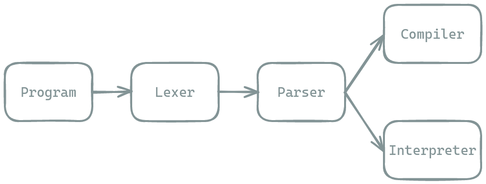

+++
title = "Making a Programming Language - 1"

[taxonomies]
tags = ["pl-tutorial"]
+++

## Making a Programming Language
I think I finally have something to write about. While I am not an *expert* with programming languages, interpreters or compilers, I feel like it would be great to:

```python
print('Hello, World!')
```

1. put down in writing everything I know currently about programming languages,
2. share to world everything I know.

I also feel trying to write this down in an instructive way will help me to reinforce a lot of the stuff I have learned. And I love explaining stuff (it's a lot of fun!). I recently took a course on Programming Languages by [Mathew](https://en.wikipedia.org/wiki/Matthew_Flatt) [Flatt](https://users.cs.utah.edu/~mflatt/), one of the creators of the really neat [Racket](https://racket-lang.org/) programming language, and I'd like to re-implement a lot of the stuff I learned in the course.

## What is a Programming Language?

> A programming language is a system of notation for writing computer programs.
> 
> &mdash; Wikipedia, The Free Encyclopedia

A programming language is the primary interface with which humans tell computers what to do. A computer program is the list of instructions and a programming language is the *specification* of what those instructions look like. A computer, being an amalgamation of horrendous digital electronics, can only understand binary data, and a human understands "language". *Compilers* and *interpreters* follow the specification, which is the programming language, and either:

1. *compile* our program into assembly,
2. or *interpret* and "act out" how the program is supposed to run on the computer.

In this tutorial, I want to talk about both *interpreters* and *compilers* and try to cover as many paradigms and techniques under the umbrella of programming languages as I can. We will build so many *interpreters* and *compilers* your head will spin.

## Brim

> Life's enchanted cup sparkles near the brim.
> 
> &mdash; [Lord Byron](https://en.wikipedia.org/wiki/Lord_Byron)

The language we will be building stuff for is called **Brim**. I named it **Brim** because I want it to be filled to the **brim** with ✨features✨. The specification of **Brim** is very very simple. Here is the factorial function in **Brim**:

```
(fun (factorial x)
     (if (= n 1) //if n == 1
         1 // then return 1  
         (* n (factorial (- n 1))))) // else return n * (n - 1)!
```

**Brim** is just lists of numbers and symbols. That's it. The consequence of **Brim** being this simple is that we can twist and turn it to do whatever we want it to do. Now, it may look awkward to read and write, but I don't expect anyone to use **Brim** to do real life stuff, so it's *okay* for **Brim** to be this obtuse.

I will be using the [Zig](https://ziglang.org/) programming language to implement **Brim**, but it should be easy enough for you to follow along with the language of your choice. I will also try and show you how some important pieces of code would look like in some other popular programming languages(like [Rust](https://foundation.rust-lang.org/) and [Python](https://www.python.org/)), to keep it as generic and instructive as I can. But I am assuming the person reading(you 🫵) knows how to program stuff, so I may skip over something I feel all programmers *would* know. If you do not understand something, feel free to reach out to me and ask!

## The next step

The pipeline of our compiler/interpreter would look something like this:


The first stage is the *lexer* which takes in a program and spits out a list of *tokens*. A token is the indivisible unit of your program. A **Brim** program is made out of (for now...) 4 indivisible tokens:
1. numbers, like `12345`
2. symbols, like `fun`, `if`, `+`
3. brackets: `(` and `)`

A **Brim** program that looks like this:

```
(+ x 1)
```

would be split into tokens as such:

```
`(:lparen` `+:symbol` `x:symbol` `1:number` `):rparen`
```


Then the *parser* gets the list of tokens, and tries to make sense of it. It is the responsibility of the parser to reject nonsensical programs like:

```
) 1 x + (
```

Then if we are *interpreting* the program, we just run the program ourselves and spit out a what `x + 1` should be. If we are *compiling* the program we would spit out either assembly or some other language.

In the next post we will talk about *tokens* and *lexers*.
